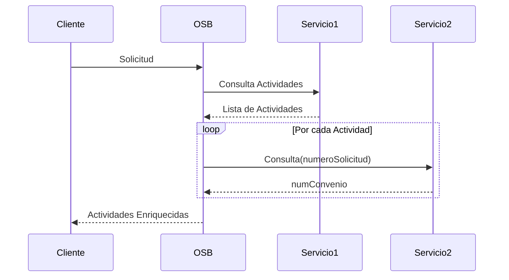
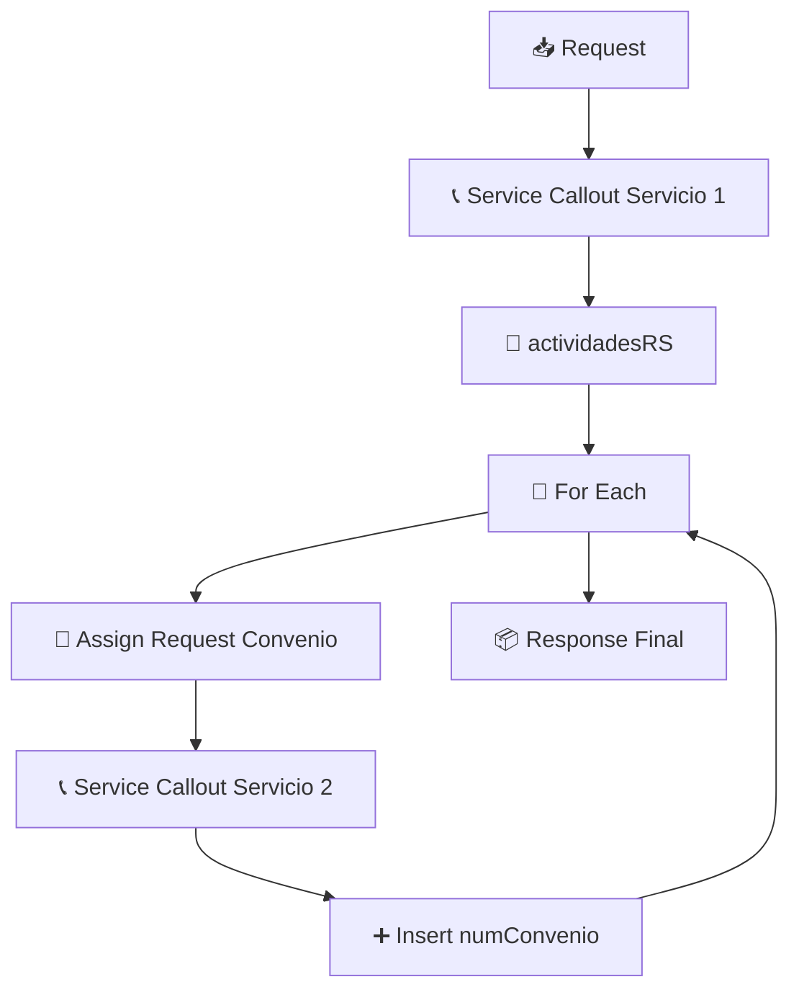

# 🚀 Oracle OSB 12c - Enriquecimiento de Actividades con Información de Convenio

<p align="center">
  
  
  
</p>

---

# 📋 Descripción

Esta operación implementa un patrón de **Data Enrichment (Content Enricher)** en Oracle Service Bus 12c.

El flujo consume un servicio principal que retorna una colección de actividades. Para cada actividad se invoca un segundo servicio utilizando el campo `numeroSolicitud`, obteniendo el valor `numConvenio`, el cual es incorporado al objeto original antes de retornar la respuesta al consumidor.

---

# 🎯 Objetivo

Transformar una respuesta de este tipo:

```xml
<actividad>
    <numeroSolicitud>1001</numeroSolicitud>
    <fecha>20260609</fecha>
</actividad>
```

En una respuesta enriquecida:

```xml
<actividad>
    <numeroSolicitud>1001</numeroSolicitud>
    <fecha>20260609</fecha>
    <numConvenio>ABC123</numConvenio>
</actividad>
```

---

# 🏛️ Arquitectura


---

# 🔄 Secuencia de Ejecución



---

# 📥 Servicio 1

## Respuesta

```xml
<ActividadesRS>
   <actividades>

      <actividad>
         <numeroSolicitud>1001</numeroSolicitud>
         <fecha>20260609</fecha>
      </actividad>

      <actividad>
         <numeroSolicitud>1002</numeroSolicitud>
         <fecha>20260609</fecha>
      </actividad>

   </actividades>
</ActividadesRS>
```

---

# 📤 Servicio 2

## Request

```xml
<ConsultaConvenioRQ>
   <numeroSolicitud>1001</numeroSolicitud>
</ConsultaConvenioRQ>
```

## Response

```xml
<ConsultaConvenioRS>
   <numConvenio>ABC123</numConvenio>
</ConsultaConvenioRS>
```

---

# 📦 Resultado Final

```xml
<ActividadesRS>
   <actividades>

      <actividad>
         <numeroSolicitud>1001</numeroSolicitud>
         <fecha>20260609</fecha>
         <numConvenio>ABC123</numConvenio>
      </actividad>

      <actividad>
         <numeroSolicitud>1002</numeroSolicitud>
         <fecha>20260609</fecha>
         <numConvenio>XYZ456</numConvenio>
      </actividad>

   </actividades>
</ActividadesRS>
```

---

# ⚙️ Implementación en Oracle OSB

## Paso 1 - Invocación Servicio 1

| Propiedad | Valor |
|------------|--------|
| Acción | Service Callout |
| Variable Respuesta | `$actividadesRS` |

---

## Paso 2 - Iteración de Actividades

### Acción

```text
For Each
```

### XPath

```xpath
$actividadesRS/act:ActividadesRS/act:actividades/act:actividad
```

### Variable de Iteración

```text
actividadActual
```

---

## Paso 3 - Construcción Request Servicio 2

### Variable

```text
$requestConvenio
```

### Assign

```xml
<con:ConsultaConvenioRQ>
   <con:numeroSolicitud>
      { data($actividadActual/act:numeroSolicitud) }
   </con:numeroSolicitud>
</con:ConsultaConvenioRQ>
```

---

## Paso 4 - Invocación Servicio 2

| Propiedad | Valor |
|------------|--------|
| Acción | Service Callout |
| Request | `$requestConvenio` |
| Response | `$convenioRS` |

---

## Paso 5 - Enriquecimiento

### Acción

```text
Insert
```

### Posición

```text
As Last Child
```

### Destino

```xpath
$actividadActual
```

### Nodo a Insertar

```xml
<act:numConvenio>
{
   data(
      $convenioRS/con:ConsultaConvenioRS/con:numConvenio
   )
}
</act:numConvenio>
```

---

# 📊 Pipeline Completo



---

# 🛡️ Manejo de Errores

## Recomendación

Implementar un Error Handler dentro del Stage donde se realiza el Service Callout al Servicio 2.

### Alternativas

#### Opción 1

```xml
<numConvenio/>
```

#### Opción 2

```xml
<numConvenio>N/A</numConvenio>
```

#### Beneficio

Permite continuar el procesamiento de las demás actividades aunque una consulta falle.

---

# 📈 Consideraciones de Rendimiento

## Escenario Recomendado

✅ Menos de 20 actividades por solicitud.

```text
Servicio1
   ↓
For Each
   ↓
Servicio2
   ↓
Respuesta
```

## Escenario de Alto Volumen

Cuando existan decenas o cientos de actividades:

- Evitar una llamada por cada registro.
- Implementar una operación batch.
- Utilizar BPEL para orquestaciones complejas.
- Evaluar paralelización.
- Considerar caché de convenios.

---

# 🧩 Variables Utilizadas

| Variable | Descripción |
|-----------|-------------|
| $actividadesRS | Respuesta Servicio 1 |
| actividadActual | Nodo actual del For Each |
| $requestConvenio | Request Servicio 2 |
| $convenioRS | Respuesta Servicio 2 |

---

# 📚 Patrones de Integración Aplicados

| Patrón | Uso |
|---------|-----|
| Content Enricher | ✅ |
| Service Orchestration | ✅ |
| Request-Reply | ✅ |
| Message Transformation | ✅ |
| Service Callout | ✅ |

---

# ✅ Beneficios de la Solución

- Centraliza la lógica de integración.
- Evita cambios en los consumidores.
- Mantiene contratos desacoplados.
- Facilita futuras ampliaciones.
- Implementación simple y mantenible.
- Compatible con Oracle OSB 12c.

---

## 👨‍💻 Tecnología

- Oracle Service Bus 12c
- XQuery/XPath
- Service Callout
- XML Schema (XSD)
- SOAP Services

---

<p align="center">
<b>Oracle Service Bus 12c</b><br>
Patrón de Integración: Content Enricher / Data Enrichment
</p>
